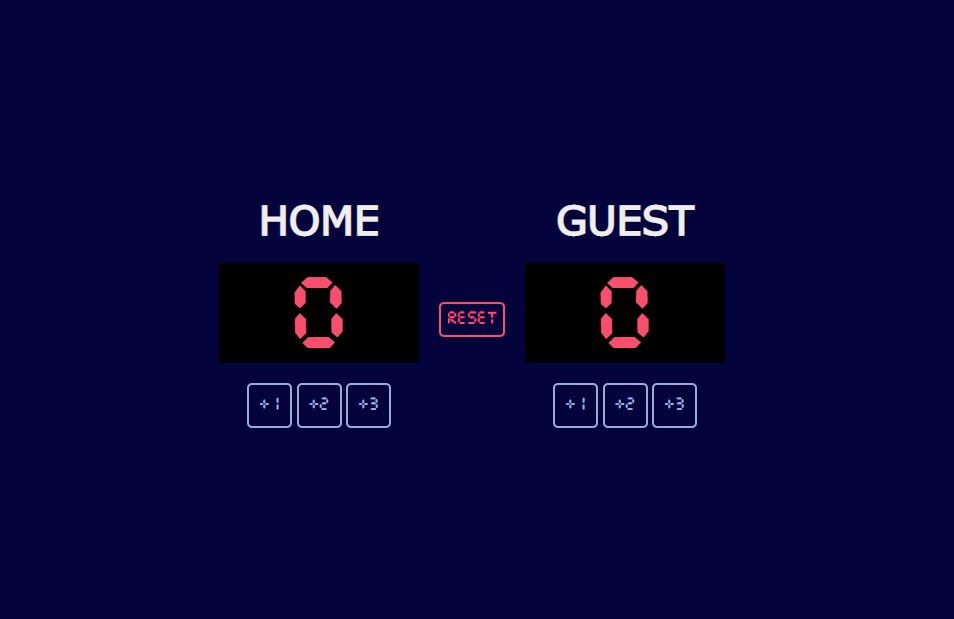

# Scoreboard Display

### Screenshot

## My process

Hi, this is a solo and a very simple example of a typical score display used in games such as Basketball, Hockey and many others.

### How the project works

So, this is basicallly a score display, where there is a Home team and a Guest team.
We can input the wanted values such as +1 +2 and +3 into the display Scoreboard.
We can also reset the scoreboard as whenever we wish to do so.

### Built with

- Semantic HTML5
- CSS
- Javascript
